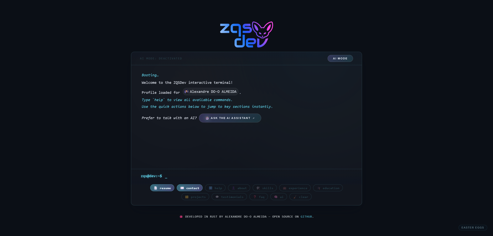

# ZQS Terminal — Rust Résumé in Your Browser
[](https://app.netlify.com/projects/zqsdev/deploys)  

An immersive single-page web terminal that reveals Alexandre DO-O ALMEIDA’s résumé through typed commands. Everything is written in **Rust**, compiled to WebAssembly, and ships as a framework-free SPA for fast cold starts.



## Features
- Web-only terminal UI with history, autocomplete, theming, achievements, and an **AI Mode** toggle.
- Static résumé data sourced from JSON so updates never require a recompile.
- Optional AI concierge proxied through an Axum service that tracks spend limits (≤ €0.50/min, €2/hour & day, €10/month).
- Build pipeline ships optimized WebAssembly + minified CSS in `static/`, ready for any CDN with an optional Axum proxy.

## Repository Layout
```
.
├── Cargo.toml            # Workspace root + WebAssembly crate manifest
├── VERSION               # Project version (sync via scripts/bump_version.py)
├── Makefile              # Build/test/deploy entry points (wasm-pack, Netlify, logs)
├── netlify.toml          # Netlify deploy config (redirects, cache headers)
├── .env.example          # Template for required/optional environment variables
├── src/                  # Rust/WebAssembly terminal (commands, state, renderer)
├── server/               # Axum proxy (OpenAI relay, rate limiting, static host)
├── static/
│   ├── index.html        # Terminal shell + module bootstrap
│   ├── style.css         # Source stylesheet (minified to style.min.css)
│   ├── style.min.css     # Minified styles generated by make build
│   ├── data/             # Résumé JSON (profile, skills, experience, education, projects)
│   ├── images/           # Logos & Open Graph artwork
│   ├── icons/            # Favicons & manifest assets
│   ├── effects/          # Visual flourish assets (canvas, particles, etc.)
│   ├── cv/               # Standalone résumé viewer bundle
│   └── pkg/              # wasm-bindgen output mirrored from /pkg
├── pkg/                  # Raw wasm-pack artefacts (ignored by git)
├── scripts/
│   ├── bump_version.py   # Bumps VERSION + Cargo manifests
│   ├── live_smoke_test.py  # Production smoke test
│   ├── minify_css.py     # CSS minifier invoked by make build
│   ├── run_live_autotest.sh  # CI helper for the smoke test
│   └── serve.py          # Static dev server (writes server.log)
└── screenshot_zqsdev.png # README showcase image
```

## Quick Start
Install the prerequisites once:
```bash
rustup target add wasm32-unknown-unknown
cargo install wasm-pack
```

Fetch dependencies and build the terminal bundle:
```bash
make build
```

## Commands
Inside the terminal, try:

```
help        about       skills       experience
education   projects    testimonials contact
faq         resume      theme        ai
clear
```

Flip on **AI Mode** with the toolbar button to ask natural-language questions. When disabled, helper chips provide quick access to the commands above.

## Development Workflow

```bash
# 1. Compile the WebAssembly bundle (writes static/pkg/)
make build

# 2. Run the full Rust stack (serves static assets + /api/ai)
export OPENAI_API_KEY=sk-your-key   # required for AI mode
make serve                          # http://localhost:3000 by default

# Optional: static-only dev server (no AI proxy, logs to server.log)
make serve-static                   # http://localhost:8765 by default
```

Useful overrides:
```bash
make serve HOST=127.0.0.1 SERVER_PORT=4000
make serve-static STATIC_PORT=9000
```

`make build` always refreshes `static/pkg/` and `static/style.min.css`, both of which must ship alongside the rest of `static/` for deployment.

## Tests & Quality Gates

```bash
make test   # wasm-pack test --node + cargo test for the proxy
make fmt    # cargo fmt across the workspace
make check  # cargo check --target wasm32-unknown-unknown
```

The CI pipeline should run the same trio so local runs stay in lockstep with automation.

## Live Production Smoke Test

Run `make autotest` (or directly `python3 scripts/live_smoke_test.py`) to exercise the deployed site once end-to-end. It validates the Netlify bundle, the `/api/data` payloads, and sends a single question to the AI concierge. Install the lone dependency with `pip install requests`, then wire either command into your scheduler (cron, GitHub Actions, etc.). Optional flags:

```bash
python3 scripts/live_smoke_test.py --json-output live-smoke.json
python3 scripts/live_smoke_test.py --ai-question "What's new with Alexandre?"
# Or via make (flags are forwarded):
make autotest AUTOTEST_FLAGS="--json-output live-smoke.json"
```

The script exits non-zero on failure so monitors can trigger alerts. Leave the AI question count at one per run to respect the production rate limits. For cron jobs, `scripts/run_live_autotest.sh` wraps the Python entry point with sensible defaults.

If `PUSHOVER_API_TOKEN` and `PUSHOVER_USER_KEY` are present (in the environment, `.env.local`, or `.env`), the script will send a Pushover alert only when a check fails or the run ends early with skipped tests. Disable that behaviour with `--no-pushover` or `AUTOTEST_FLAGS="--no-pushover"` if needed.

## Environment Variables

1. Copy the template:
   ```bash
   cp .env.example .env
   ```
2. Update at least `OPENAI_API_KEY=...` if you plan to enable AI Mode locally.

`OPENAI_API_KEY` is the only required secret today. The template also reserves slots for `GROQ_API_KEY`, `PUSHOVER_USER_KEY`, and `PUSHOVER_API_TOKEN` so future integrations can reuse the same workflow. The proxy loads `.env.local` first, then `.env`, which keeps machine-specific overrides out of version control. Both files are ignored by git so real keys stay on your machine.

## Versioning & Release Workflow
- Run `make build` and `make test` before handing changes off so `static/pkg/` and the proxy both stay green.
- Bump the version with `python3 scripts/bump_version.py` (touches `VERSION`, `Cargo.toml`, and `server/Cargo.toml`). The script defaults to patch releases; pass `--minor` or `--major` when needed.
- Commit only the sources, regenerated assets under `static/pkg/`, and version bumps. Artifacts in `/pkg`, local env files, and logs (`server.log`) are ignored by default.

## Customising the Résumé
- Update the résumé link in `static/data/profile.json` (`links.resume_url`).
- Edit the JSON files in `static/data/` to refresh profile details, experiences, and skills.

## Deployment
The server is optional at runtime; the public site is served from the static bundle.

### Netlify (www.zqsdev.com & zqsdev.com)
- `netlify.toml` owns redirects so the SPA loads everywhere while `cv.zqsdev.com` serves the résumé viewer and `calendly.zqsdev.com` forwards to Calendly.
- `/api/*` requests proxy through Netlify to `https://api.zqsdev.com/api/:splat`, keeping browser requests same-origin while hitting the Axum backend.
- Install the Netlify CLI (`npm install -g netlify-cli`) and authenticate once with `netlify login` or `NETLIFY_AUTH_TOKEN`.
- `make deploy-preview` → runs `make build` then `netlify deploy --dir static --config netlify.toml`.
- `make deploy-prod` → same flow with `--prod`. Pass extra flags via `NETLIFY_FLAGS` (e.g. `NETLIFY_FLAGS="--alias staging"`).

### Self-hosting (optional)
1. Run `make build`.
2. Publish the contents of `static/` (including `static/pkg/`) to your CDN or object store.

If you want AI Mode in production, deploy the proxy (e.g. on Fly.io, Railway, or a small VPS) with:

- `OPENAI_API_KEY` set.
- Optional `HOST`, `PORT`, and `STATIC_DIR` overrides.

The proxy reads `static/data/*.json` at startup, forwards questions to `gpt-4o-mini`, and enforces spend ceilings before gracefully falling back to the classic terminal experience when limits trigger.

### Systemd service (production)
- Unit file: `/etc/systemd/system/zqs-terminal.service` runs `/opt/zqsdev/bin/zqs-terminal-server` as the `zqsdev` user with `WorkingDirectory=/opt/zqsdev`.
- Environment lives in `/etc/zqsdev/server.env`, including `HOST=0.0.0.0`, `PORT=8787`, `STATIC_DIR=/opt/zqsdev/static`, and the API keys used at runtime.
- Manage the service with `sudo systemctl status|restart zqs-terminal.service`; logs stream to `/opt/zqsdev/backend.log` (mirrored here as `./backend.log`) and via `journalctl -u zqs-terminal.service`.
- Run `make backend-log` to tail the rolling log from the repository root.
- Public ingress: `api.zqsdev.com` terminates TLS with Nginx (config at `/etc/nginx/sites-enabled/api.zqsdev.com`) and proxies to the Axum service on `127.0.0.1:8787`.
- The binary listens on port `8787/tcp` (`/api/ai`) and restarts automatically on failure.

---

Built with 🦀 Rust and ❤️ by Alexandre DO-O ALMEIDA (ZQSDev). Enjoy the terminal! 🙂
